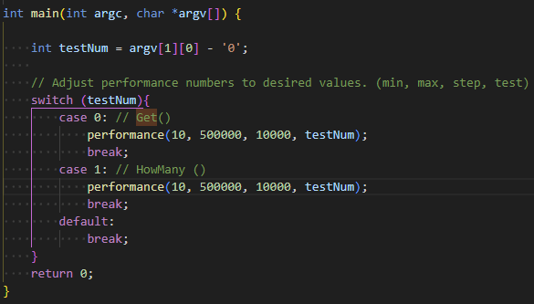
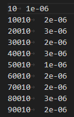
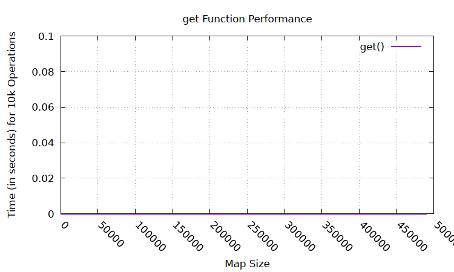
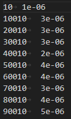
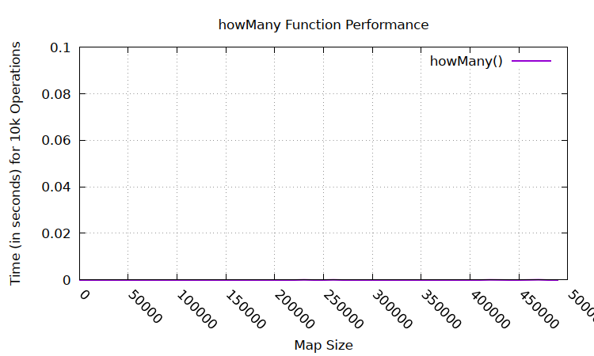

[Back to Portfolio](./)

Large-Map
===============

-   **Class: CSCI315 - Data Structure Analysis** 
-   **Grade: 100** 
-   **Language(s): C++** 
-   **Source Code Repository:** [Large-Map](https://github.com/Sanchez-RickC137/Large-Map)  
    (Please [email me](mailto:jrpike@csustudent.net?subject=GitHub%20Access) to request access.)

## Project description

Solving the common Computer Science problem of storing and searching based on key-value pairs, utilizing only arrays or linked lists. Creates an efficient map of students given a first name, last name and a student id and tests the efficiency based on the run time of a pair of functions. The get() function retrieves the student id based on the first and last name. The howMany() function returns the number of students with a given prefix. The performance of the functions is time based.

## How to compile and run the program

### Compile / Run
- Compile and run the performance analyis of the get() function for the data structure
```bash
make run-get
```

- Generate the plot based off the get() data
```bash
make dataGet
```

- Compile, performance analysis and plot generation
```bash
make run-get dataGet
```

- Compile and run the performance analyis of the get() function for the data structure
```bash
make run-howMany
```

- Generate the plot based off the get() data
```bash
make dataHow
```

- Compile, performance analyis and plot generation
```bash
make run-howMany dataHow
```
### Testing
- The following test can be run to test the functionality of the functions within the Map class
```bash
make add-test
make howMany-test
make remove-test
```

## UI Design
There is very little user input that is required for this program. If the user desires to change the performance parameters of the program, they can do so within the main function.

  
Fig 1. Performance adjustments

  
Fig 2. Sample get() peformance data

  
Fig 3. Sample get() peformance data plot

  
Fig 4. Sample howMany() peformance

  
Fig 4. Sample howMany() peformance plot

## 3. Additional Considerations

The functionality of the program to the user is limited in that it simply tests the performance of functions in the Map class, however the Map class itself can utilized within another program to fulfill its intended purpose of being a highly efficient data structure for storing and searching based on key-value pairs.

[Back to Portfolio](./)
