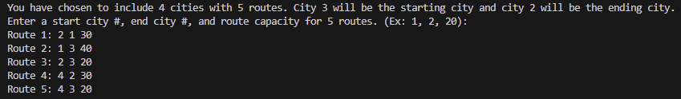
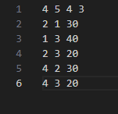

[Back to Portfolio](./)

Maximum-Flow
===============

-   **Class: CSCI415 - Algorithms** 
-   **Grade: ???** 
-   **Language(s): C++** 
-   **Source Code Repository:** [Maximum-Flow](https://github.com/Sanchez-RickC137/Maximum-Flow) 
    (Please [email me](mailto:jrpike@csustudent.net?subject=GitHub%20Access) to request access.)

## Project description

### Scenario
For a festival for Motorcycle lovers in the USA, organizers of this year plan to create a Ginis record byhaving the largest number of motorcycles traveling simultaneously between two cities. To facilitate the organization of the festival and the activities, they decided to select one city as a starting point and one cityin 300 miles away as an endpoint. They have many options in selecting the cities, so they need your help togenerate a program in C++ to find the best option. Suppose, for each option, they can provide you with thestarting city A and the target city B, all the N cities that can be used as stops for the drivers in between Aand B, and the maximum capacity Ci for the ith highway fragment connecting those cities.

### Program
The program determines the maximum flow of motorcycles that could travel simultaneously between a starting and ending city given a number of cities and routes between the cities in order to support a decision for the best starting and ending city for a motorcycle festival. The user will provide city, route, start city, end city, and routes to determine maximum flow. The information can be stored in graph_input.txt or entered manually. 

This is a well-known computer science problem involving maximum flow for which there have been a number of proposed solutions through the years.

## How to compile and run the program

- Compilation
```bash
g++ -Wextra -o MaxFlow MaxFlow.cpp
```

- Running manually
```bash
./MaxFlow 4 5 4 3
```

- Running automatically
```bash
./MaxFlow
```

## UI Design
- The program is command line based and can require a fair amount of user input which is prone to error. If there is a large data set that needs to be analyzed, the user is encouraged to place all inputs in the graph_input.txt document to avoid error.

- There are 2 types of data that must be provided to the program.
-- 4 integers with spaces between (4 5 4 3), which represent number of cities, number of highways, a start city and an end city respectively
-- 3 integers with spaces between (4 2 30), which represent the highways between cities given by start city, end city and capacity respectively.

- The number of 3 integer sets is determined by the number of highways (2nd integer of the first set).


  
Fig 1. Compilation

  
Fig 2. Run automatic

  
Fig 3. Run manual

  
Fig 4. Manual highway input

  
Fig 5. File Input

  
Fig 6. Output

## 3. Additional Considerations


[Back to Portfolio](./)
