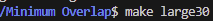
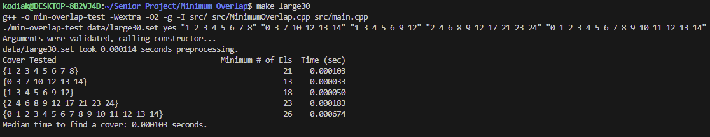

[Back to Portfolio](./)

Minimum-Overlap
===============

-   **Class: CSCI315 - Data Structure Analysis** 
-   **Grade: 100** 
-   **Language(s): C++** 
-   **Source Code Repository:** [Minimum-Overlap](https://github.com/Sanchez-RickC137/Minimum-Overlap)  
    (Please [email me](mailto:jrpike@csustudent.net?subject=GitHub%20Access) to request access.)

## Project description

This project determines the Minimum Overlap of sets that cover all points. Given the scenario that we have multiple group projects for a class of students that needed to be presented and every student must be graded at least once, but we want to minimize the number grades that must be performed. The professor does not mind grading multiple projects. Students can be members of multiple projects, but only want to present once. How can we minimize the number of times a student has to present? Everyone in a group has to present (no partial group presentations) and a grade must be assigned for each group member.

The program utilized sets of numbers which represents group projects and the student numbers that are assigned to that project. Given a set of students that must be graded, the program will return the minimum number of student grades that must be completed, based on the students precense within group project sets, in order to satisfy the requirement of grading each student one time. The performance data of the algorithm for this determination is also gathered and provided to the user.


## How to compile and run the program
The user can choose to run predetermined data sets and covers(set of students to grade) or can choose their own cover and run it against a data set.

- Compilation
```bash
make all
```

- Compile program and run using a small set of predetermined covers. Choose one of the following to run.
```bash
make run
make small30
make med30
make large30
make large50
make small100
```

- Compile program and run using a large set of predetermined covers. Choose one of the following to run.
```bash
make small-timings
make medium-timings
make large30-timings
make large-timings
```

- Run without compilation with a user determined cover. The user must specify which data set that they will run the cover against.
-- ./min-overlap-test data/"filename of data set" no "user cover"
```bash
./min-overlap-test data/large30.set no "1 12 14 5 3 2"
```
or multiple covers can be manually input as well
```bash
./min-overlap-test data/large30.set no "1 12 14 5 3 2" "3 10 5 1 4"
```

## UI Design
The program is command line based and requires only initial inputs from the user to determine data sets to reference and what covers to utilize. 

  
Fig 1. Compiling and running the program with predetermined covers

  
Fig 2. Compiling and running the program with user provided covers


Fig 3. Program Output

  
Fig 4. Error for referencing an unknown make command for the program.

  
Fig 4. Error in the syntax for manually inputing covers with the program.

## 3. Additional Considerations
This program is purpose built for the project that it covered however it deals with the common computer science minimum overlap problem and can be refactored to meet the needs of the user. The current input and user interface is limited but could easily be changed to meet a number of needs.

[Back to Portfolio](./)
