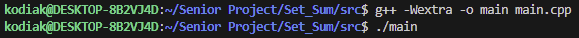
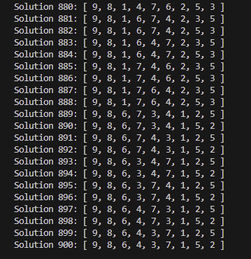

[Back to Portfolio](./)

Permutation-Mathematics
===============

-   **Class: CSCI415 - Algorithms** 
-   **Grade: 100** 
-   **Language(s): C++** 
-   **Source Code Repository:** [Permutation-Mathematics](https://github.com/Sanchez-RickC137/Permutation-Mathematics)  
    (Please [email me](mailto:jrpike@csustudent.net?subject=GitHub%20Access) to request access.)

## Project description

The program generates all possible permutations of the numbers 1 through 9 to solve the given problem "_ / _ * _ + _ * _ * _ / _ + _ * _ = 100" where each blank represents a number from 1 to 9 with no numbers repeated.

## How to compile and run the program

- Compilation
```bash
g++ -Wextra -o main main.cpp
```

- Running
```bash
./main
```

## UI Design
There is no user input for this program. The output is command-line based and consists of all the solutions for the given mathematics equation.

  
Fig 1. Compilation and running of the program

  
Fig 2. Program output

## 3. Additional Considerations
The program is designed to find every permutation to solve a math problem, but the math problem could be changed to solve a different problem or some of the code could be utilized for the purposes of simple permutation generation.

[Back to Portfolio](./)
