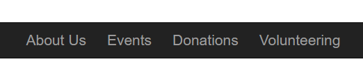
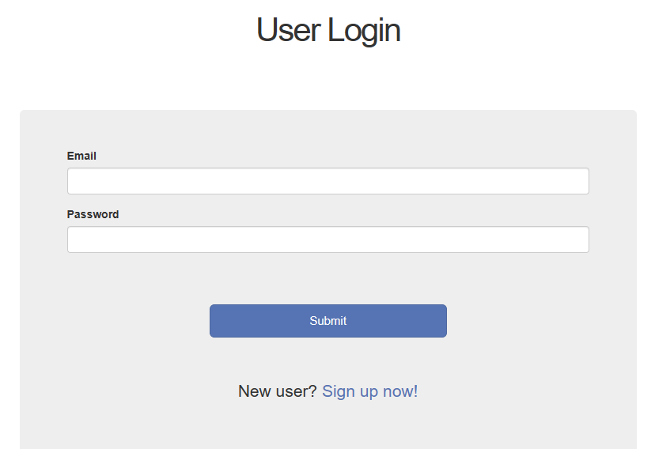
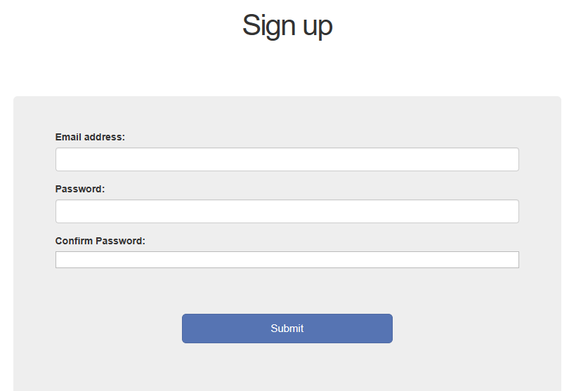

[Back to Portfolio](./)

Race-Registration-App
===============

-   **Class: CSCI334 - User-Interface Programming** 
-   **Grade: 100** 
-   **Language(s): HTML, CSS, Ruby** 
-   **Source Code Repository:** [Race-Registration-App](https://github.com/Sanchez-RickC137/Race_Registration_App)  
    (Please [email me](mailto:jrpike@csustudent.net?subject=GitHub%20Access) to request access.)

## Project description

This is a website for a fictitious non-profit, the Animal Welfare Foundation, which is putting on a 5K run this year on June 19th to raise money for the cause. The website serves as a place for people to learn more about the charity, sign up for the 5K, and get information about the 5K run. Responsive web design is employed to support desktop, tablet and mobile devices.

## Repository Cloning
* Navigate to the current working directory where you would like the repository
* Enter the following command in the terminal
   - git clone https://github.com/Sanchez-RickC137/race_registration_app.git
* For further support reference:
   - https://docs.github.com/en/repositories/creating-and-managing-repositories/cloning-a-repository
 
## Deployment
* This will be dependent on the server/application that you want to host your website.

## Database
* Initialization:
   - rails db:seed - Will create 100 users for the website. First user will be the only admin for all the users. The rest will be randomly generated.
   - Admin user Login: email: "example@railstutorial.org" / password: "foobar"
   - When registering a new user that is the first user, they will by default be the only admin.

* Reset:
   - rails db:migrate:reset

* Manual Registrations:
  - Accessed at the user login screen or through the 5k event screen

## UI Design

### Site Layout - Pages
* Home
   - Static-Page: home.html.erb
   - Every page of the site with the exception of registering can be accessed from this page
   - Return to home page by click AWF logo in top left hand corner\
  
Fig 1. Home Page

* About Us
   - Static-Page: about.html.erb
   - Accessed on the navigation bar at the top of every page\
      
    Fig 2. Navigation

* Events
   - Static-Page: events.html.erb
   - Accessed on the navigation bar at the top of every page
   - Serves as a page for access to all current events being held by the organization

* Event 1
   - This serves as 5k specific event page with general information and is the point at which a user can REGISTER for the event

* Event 2
   - This is an additional ficticious event page for the organization.

* Event 3
   - This is an additional ficticious event page for the organization.

* Giving
   - Serves as a donation information page and directions on ways to support through giving.

* Volunteering
   - Serves as a volunteer information and direction page on ways to support through volunteering.

### Site Layout - Users
* New users
   - Serves as the initial sign-up page for new users
   - Reached by clicking the registration button for the event or at login screen.
   - Information is validated on submission\
      
    Fig 3. Login/Signup
      
    Fig 4. Registration 

* Edit users
   - Serves the purpose of editing a user's own information as well as editting another user's information if the current user is an administrator
   - Reached by clicking contact info on the logout / account dropdown or the edit button in the administrator view
   - Administators can assign other registered users as administrators on this page by checking the specified box and submitting
   - Information is validated on submission

* Exclusive Content
   - Serves as the user home page with more extensive race details. Can only be seen when a user is logged in.

* Administrator Content
   - Serves as the administrator page to view all current registered users and link to edit them as neccessary.
   - Information is formatted in a table.

[Back to Portfolio](./)
