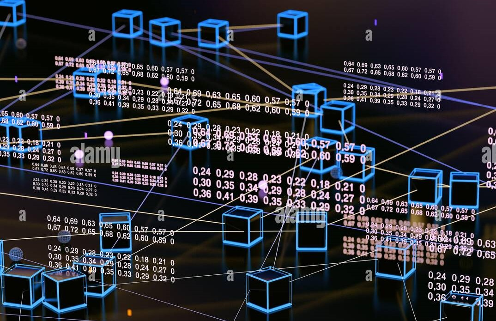
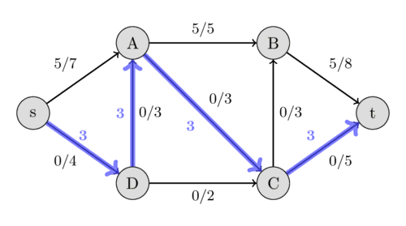

Portfolio
=========

Programming Projects
--------------------

*For access to my private project repositories, please [email me](mailto:example@csustudent.net?subject=GitHub%20Access) with the subject line, GitHub Access.

---
### [Large-Map | CSCI 315](https://github.com/Sanchez-RickC137/Large-Map)

---
### [Minimum-Overlap | CSCI 315](https://github.com/Sanchez-RickC137/Minimum-Overlap)

---
### [Race-Registration-App | CSCI 334](https://github.com/Sanchez-RickC137/Race-Registration-App)

---
### [Permutation-Mathematics | CSCI 415](https://github.com/Sanchez-RickC137/Permutation-Mathematics)

---
### [Maximum-Flow | CSCI 415](https://github.com/Sanchez-RickC137/Maximum-Flow)

---

Ethics Papers
-------------

### [Copyright and Licenses](https://github.com/Sanchez-RickC137/Sanchez-RickC137.github.io/blob/master/pdf/Copyright%20and%20Licenses.pdf)

-   **Course: CSCI315 - Data Structure Analysis**  
-   **Grade: 100**

### [Software Testing & Reliability](https://github.com/Sanchez-RickC137/Sanchez-RickC137.github.io/blob/master/pdf/Software%20Testing%20%26%20Reliability.pdf)

-   **Class: CSCI315 - Data Structure Analysis** 
-   **Grade: 100**

### [Ethical Dilemmas in Cybersecurity](https://github.com/Sanchez-RickC137/Sanchez-RickC137.github.io/blob/master/pdf/Ethical%20Dilemmas%20in%20Cybersecurity.pdf)

-   **Class: CSCI352: Cyber Defense** 
-   **Grade: 100**

---

Presentations
-------------

### [AWF Nonprofit Website Presentation](https://youtu.be/hcZogURE6EU/.)

- **Class: CSCI334 - User-Interface Programming** 
- **Grade: 100**

### [Security Presentation](https://youtu.be/17P3c9-l7XY/.)

- **Class: CSCI301 - Survey of Scripting Languages** 
- **Grade: 100**

### [Wi-Fi Security and Encryption](https://github.com/Sanchez-RickC137/Sanchez-RickC137.github.io/blob/master/pdf/Wi-FI%20Security%20and%20Encryption.pdf)

- **Class: CSCI352: Cyber Defense** 
- **Grade: 100**

---

Page template forked from <a href="https://github.com/csu-cs/csci-portfolio">CSU-CS</a>

<!-- Remove above link if you don't want to attributive -->
